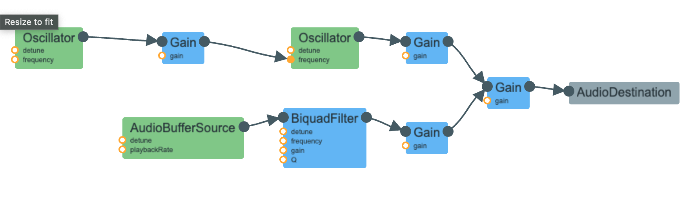

## HW3 Write Up for R2D2

### Flow Chart

### Development Process
The process of building the R2D2 sound started smoothly and ended up being quite cumbersome. The Farnell manual hinted at using FM synthesis to get that machine like sound. When I listed to R2D2 sound recordings, I noticed how "thick" the frequencies sounded. The main sound that could be heard was pungent but not thin, which indicated a band of frequencies was being used. Therefore, I used FM synthesis to get the overall robotic sound of R2D2. I also tested a few modifying index values out and found that too small of a value resulted in not enough dissonance while too large of a value resulted in fuzziness. 

I also needed a sense of sharpness, especially when the main frequency of the noise went higher. The manual also indicated the usage of randomness. In order to simulate this randomness, I decided to add white noise with a lowpass filter. This lowpass filter added more sharpness to the overall sound, resulting in that characteristic high pitched "machine-like" noises. A higher Q value resulted in a sharper cutoff, and therefore a sharper sound. 

Each of these sounds was given their respective gains to balance out the loudness and were  then combined using a global gain. Both frequency values (FM modulation frequency and Lowpass Filter cutoff frequency) was connected to the same slider, allowing the user to manipulate the sound. In the end, the FM created the dissonant band of frequencies and the lowpass filter added sharpness to the overall sound, resulting in a machine-like sound. 